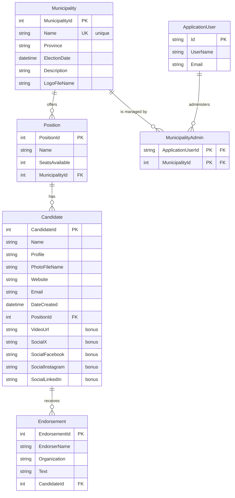

# Entity Relationship Diagram

Municipal Elections Management System — EF Core Code First model.

## Notes

- `ApplicationUser` extends ASP.NET Core Identity's `IdentityUser`; Identity's own
  `AspNetRoles`, `AspNetUserRoles`, and related tables are generated by the framework.
- `MunicipalityAdmin` is the join table that scopes a municipality admin user to a
  single municipality. It has a composite primary key of `ApplicationUserId` +
  `MunicipalityId`.
- All three relationships from `Position`, `Candidate`, and `Endorsement` cascade on
  delete; deleting a municipality therefore removes its positions, candidates, and
  endorsements.
- `Municipality.Name` carries a unique index, so no two municipalities may share a name.
